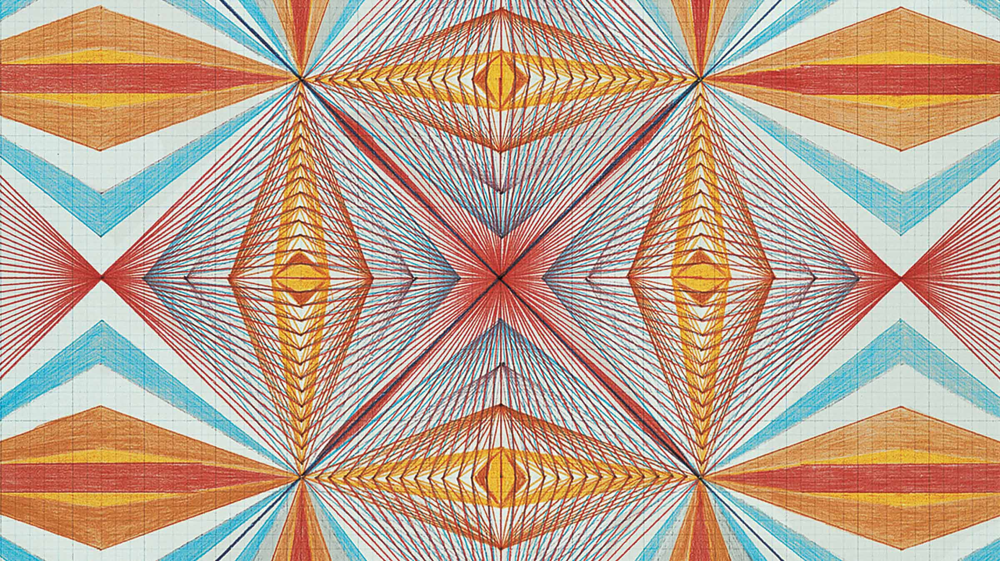

# yche0336_9103_tu8
# Week8 quiz

# Part A

Emma Kunz's artwork is characterized by the use of geometric patterns and color combinations that act like kaleidoscopes. She creates drawings with strict geometric rules, often on a scale using pendulums, compasses and rulers. While seemingly symmetrical patterns, the details are irregular, and the drawings are based on repetition and drawing rituals that make the work both precise and imperfect. I wanted to incorporate the geometric patterns in Emma's work as inspiration for my project, as the work of Pacita Abad and Piet Mondrian in the major project also featured repeated geometric patterns and combinations of colors.

# Images
Emma Kunz's artwork 
from web

# Part B

The pattern generated by this code is similar to a kaleidoscope effect. The main way to help achieve the abstract geometric pattern effect is by. drawLines() places a number of points evenly around a circle, and using a multiplier m (click by the mouse ), each point i is connected to a point of (i * m) % n. Moving the mouse changes the multiplier m, and different symmetries and patterns appear. getAngle() function ensures that the lines are accurate and symmetrical by calculating the exact angle of each point on the circle.

screenshot of code

link of the example
(https://editor.p5js.org/BarneyCodes/sketches/bTLBgkuMI)
The code was sourced from YouTube
（https://www.youtube.com/watch?v=IKhJewxMH7E）
